# 运行窗口

_./dist目录下已生成exe文件,双击打开_

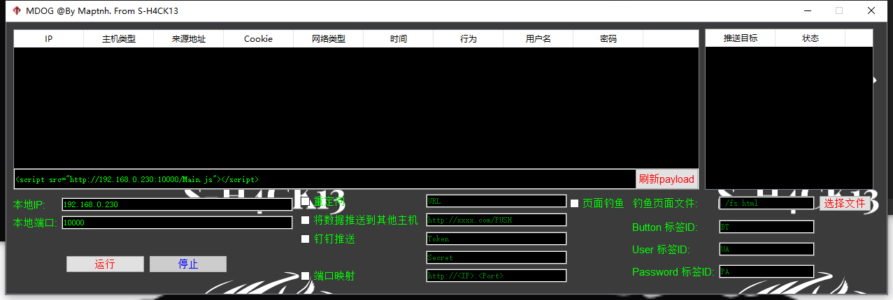

# Cookie窃取

_点击运行服务,复制以上的payload,payload怎么变形那么你可已去混淆_

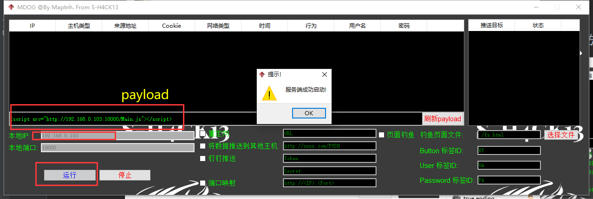

_payload在页面执行_

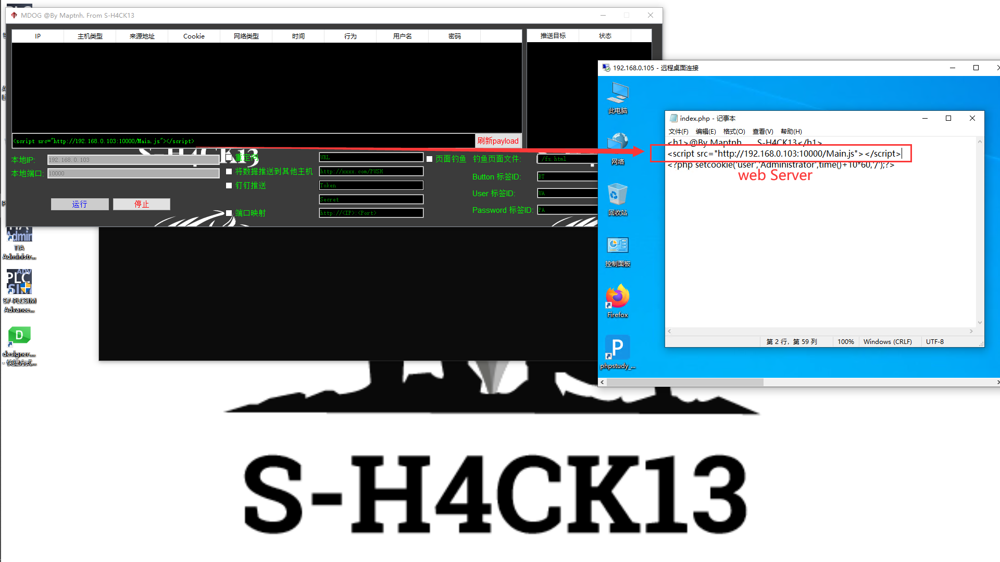

_受害者访问存在xss漏洞的页面时受到攻击,Cookie泄露_

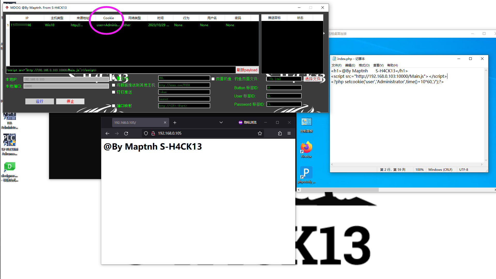

# 表单劫持

_填写完成参数后,勾选钓鱼复选框_

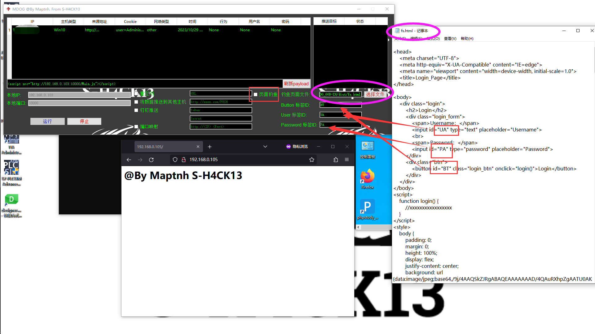

_受害者访问存在xss漏洞的页面时受到攻击,页面被劫持钓鱼,攻击者成功获取到账户密码_

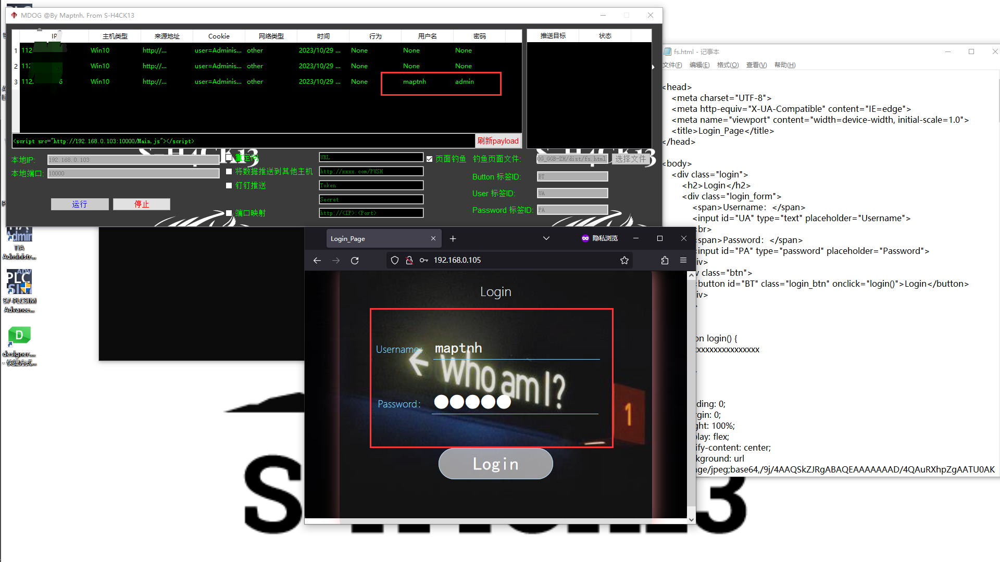

# 重定向

_输入重定向URL后,勾选复选框_

 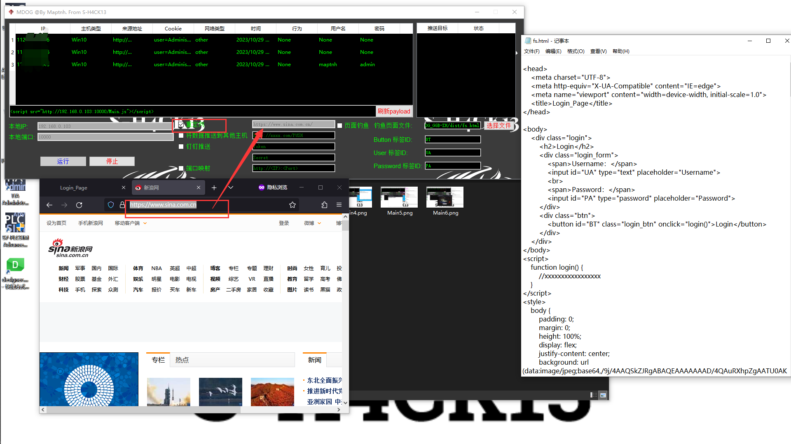

_受害者访问存在xss漏洞的页面时受到攻击,被重定向,造成流量劫持_

 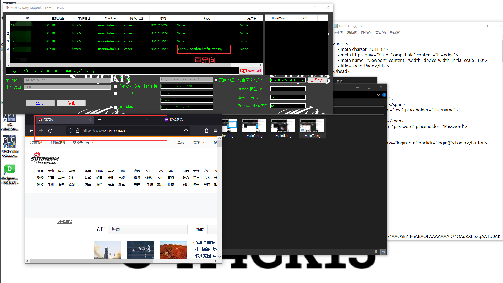

# 数据推送

_填写推送地址,必须是http开头,勾选复选框_

 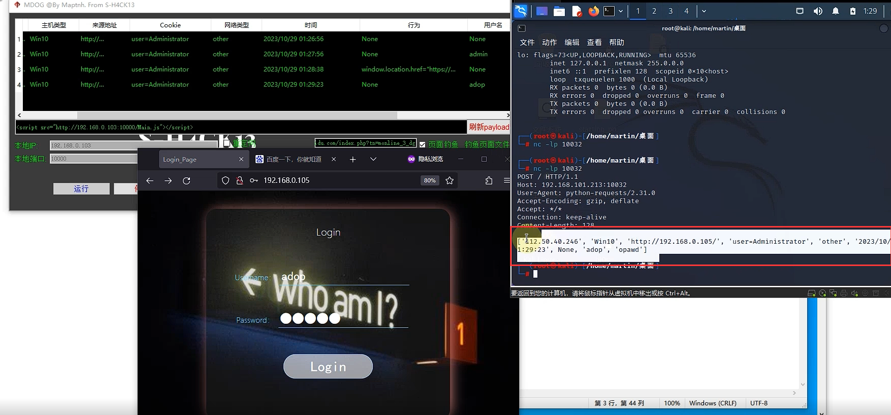

_Kali端成功收到数据_

# 钉钉推送

_打开钉钉群机器人,输入WebHook中TOKEN和加签secret的参数,勾选复选框后自动发送测试文本_

 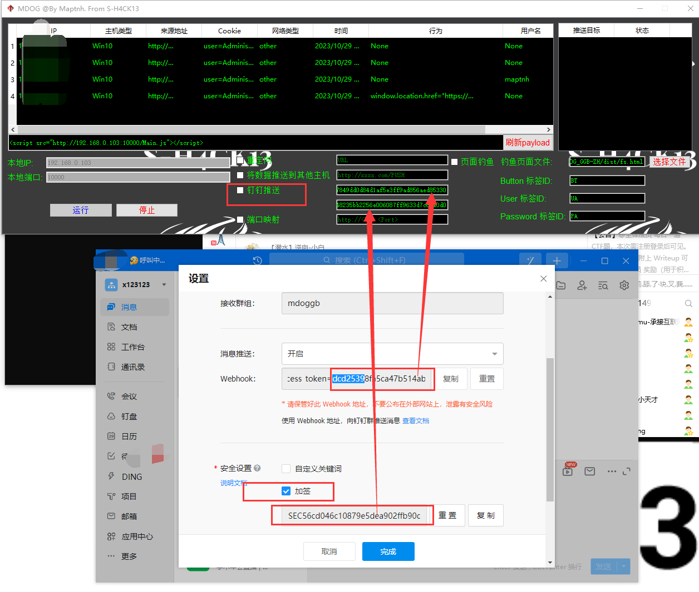

 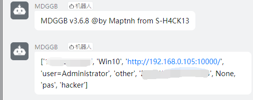

# 端口映射

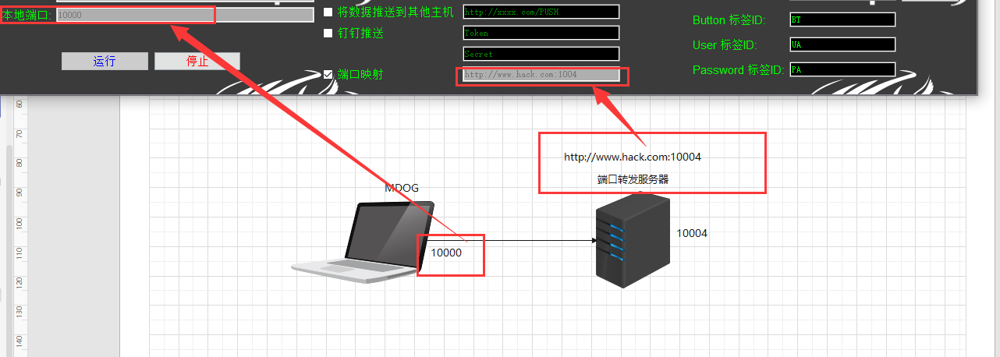

 

